# 📘 Dokumentasi Praktikum PHP MVC

## 👥 Identitas Kelompok
- Nama Kelompok: Kelompok 5  
- Backend Engineer: Noor Shahla Qeysha Revarani  
- Frontend Engineer: Patimatul Jahrah (2310010234)  
- DDO: Tasya Rosalinda (2310010225)  

## ✨ Fitur
- CRUD Mahasiswa  
- Search & Filter  
- Export CSV & PDF  
- Bootstrap UI  
- REST API  

## ⚙️ Cara Menjalankan
1. Clone repo  
2. Import database `uniska_latihan_mvc_2026`  
3. Jalankan:
   - http://mvc_mahasiswa_kelompok5.test  
   - http://localhost/mvc_mahasiswa_kelompok5  

---

## 📘 Sesi 1 – Persiapan
Tujuan: memahami MVC & setup project.

📸  
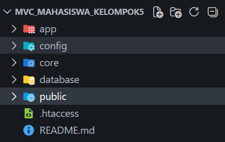  

Kesimpulan: project berhasil disiapkan.

---

## 📘 Sesi 2 – Routing
Routing: `/controller/method`

📸  
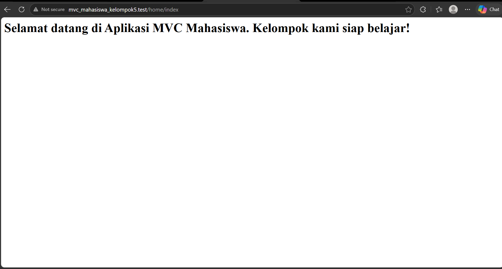  

Kesimpulan: routing berjalan.

---

## 📘 Sesi 3 – Tampil Data
Alur:
Controller → Model → Database → View  

📸  
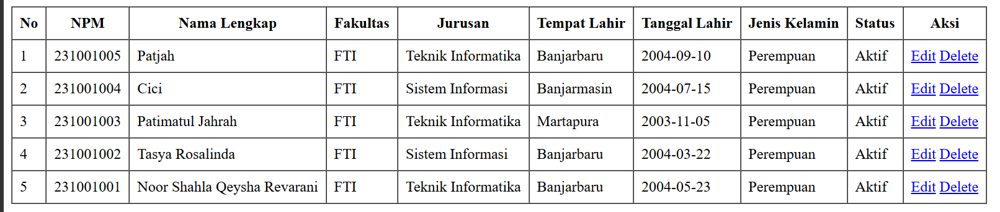  

Kesimpulan: data tampil.

---

## 📘 Sesi 4 – Tambah Data
📸  
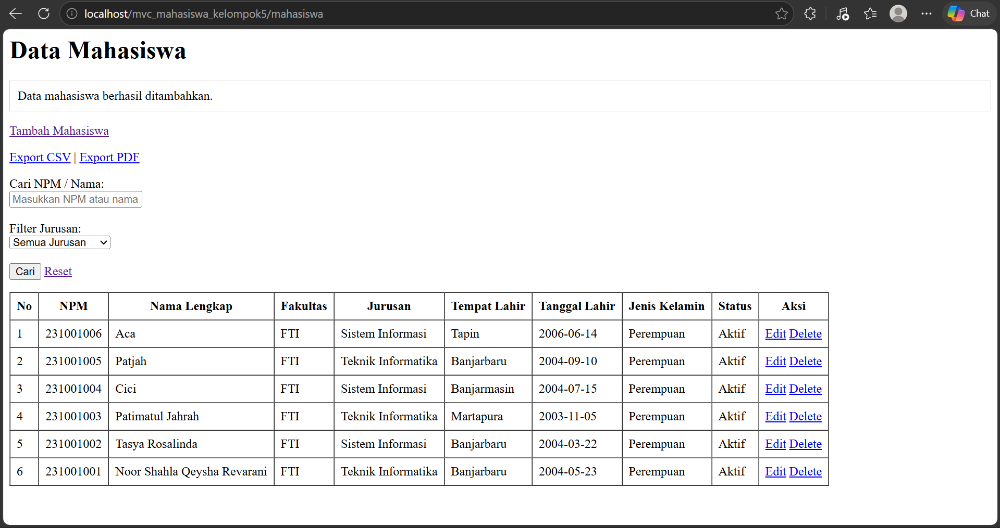  

Kesimpulan: tambah berhasil.

---

## 📘 Sesi 5 – Update & Delete
📸  
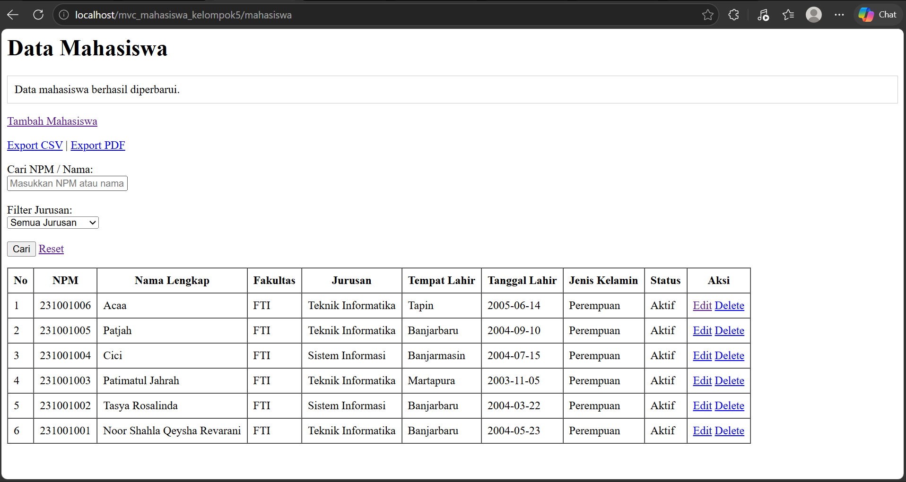  
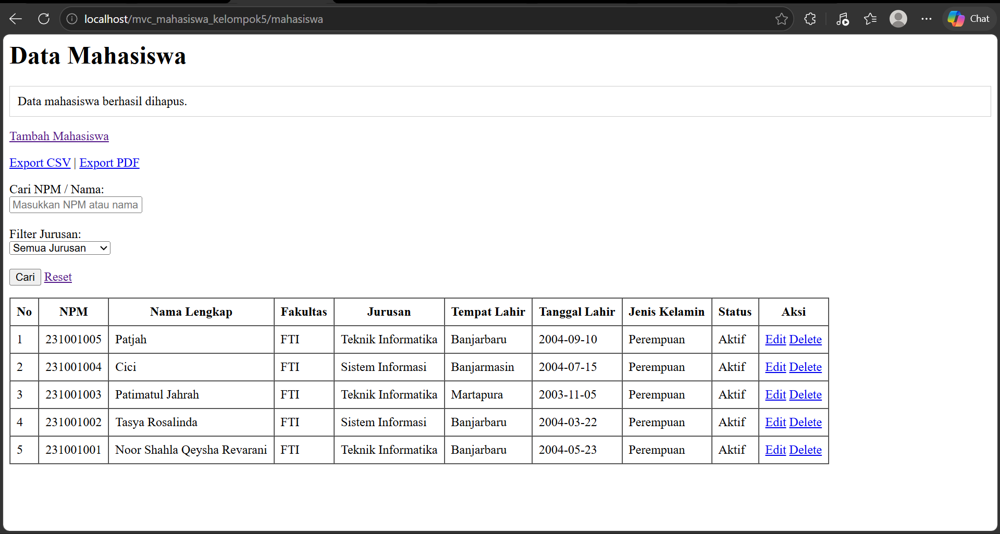  

Kesimpulan: CRUD lengkap.

---

## 📘 Sesi 6 – Search & Filter
📸  
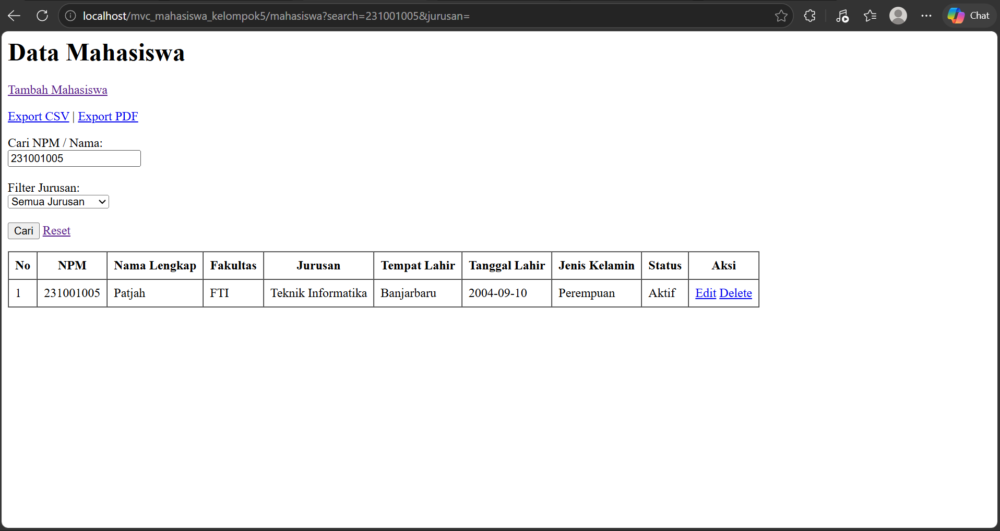  

Kesimpulan: fitur berjalan.

---

## 📘 Sesi 7 – Bootstrap
📸  
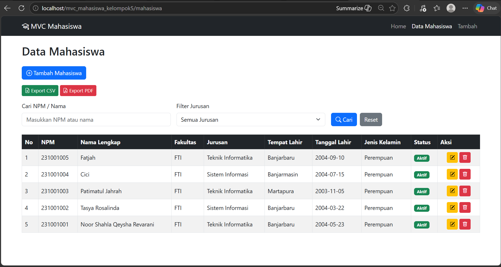  

Kesimpulan: tampilan rapi.

---

## 📘 Sesi 8 – Export
📸  
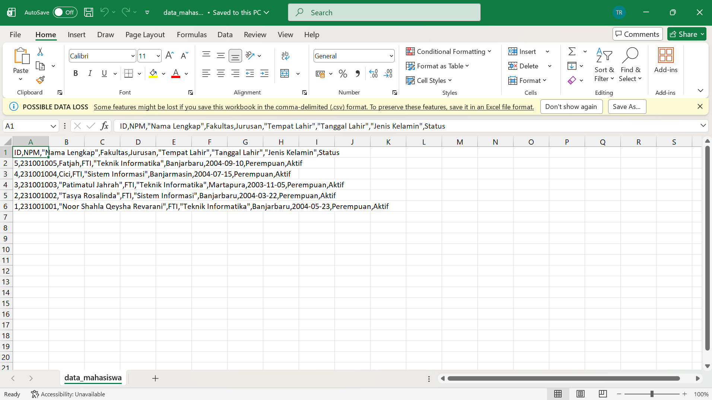  
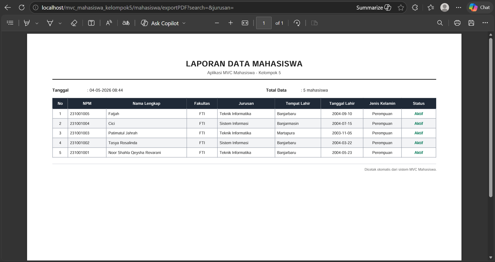  

Kesimpulan: export berhasil.

---

## 📘 API

Base URL:
http://localhost/mvc_mahasiswa_kelompok5  

Endpoint:
- GET /api/mahasiswa  
- GET /api/mahasiswa/{id}  
- POST /api/mahasiswa  
- PUT /api/mahasiswa/{id}  
- DELETE /api/mahasiswa/{id}  

📸  
### GET Semua Data
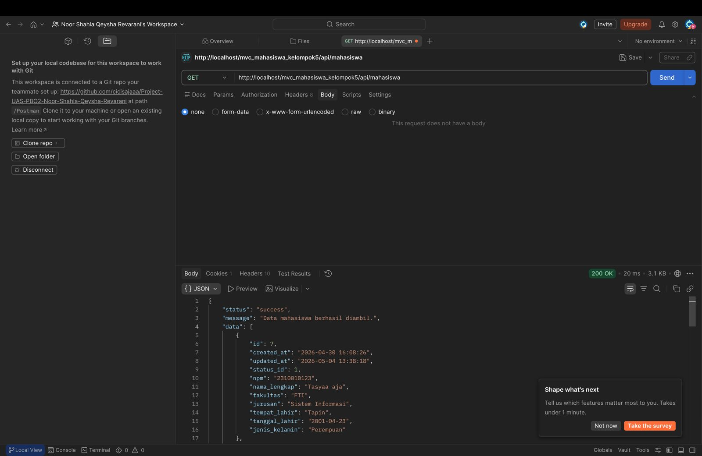

### GET Detail
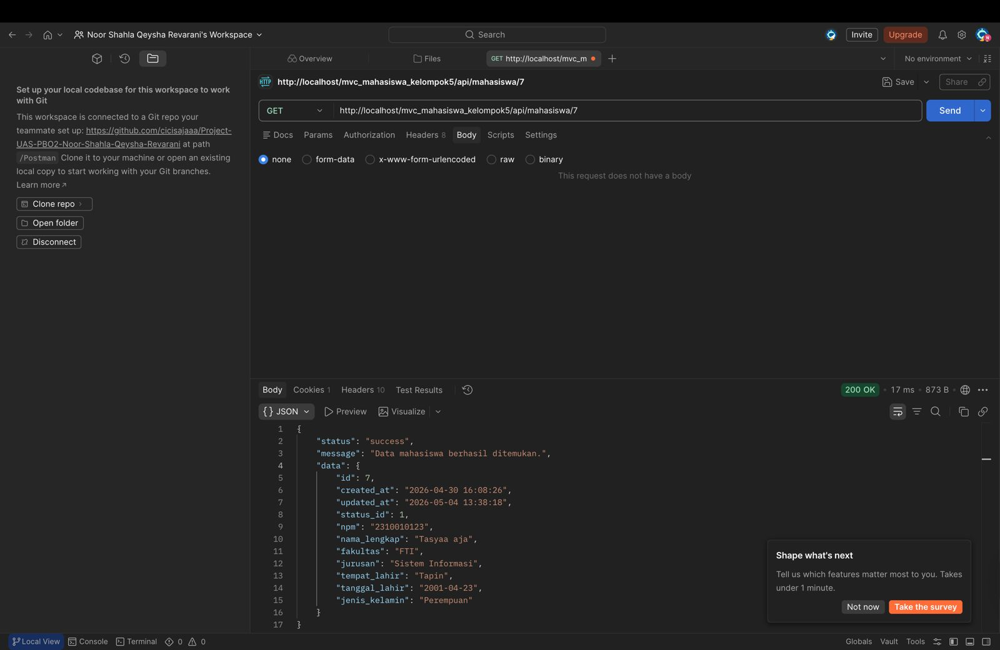

### POST Tambah
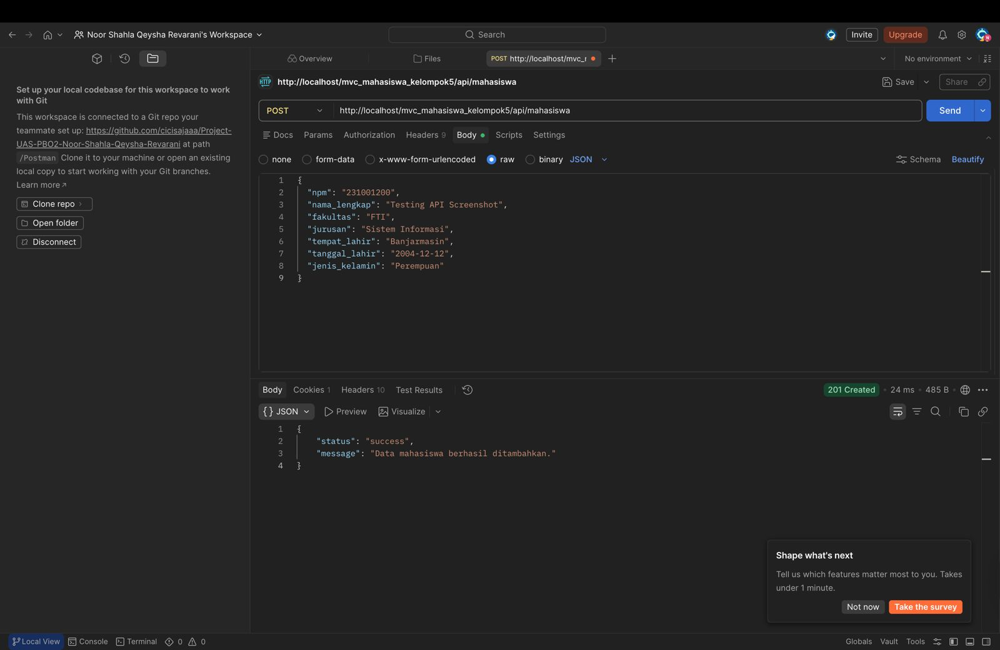

### PUT Update
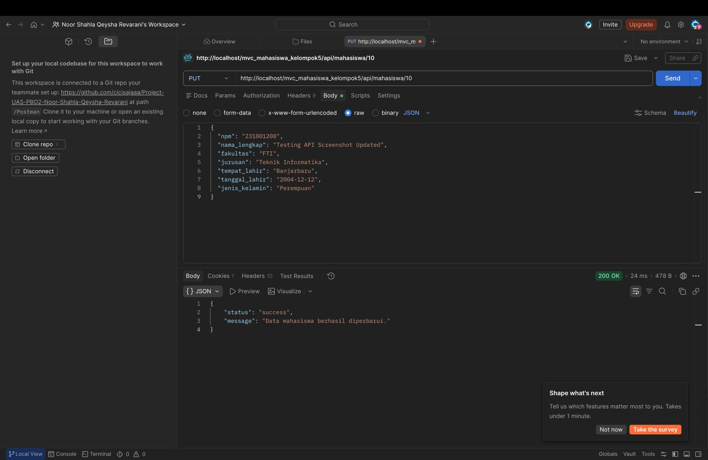

### DELETE
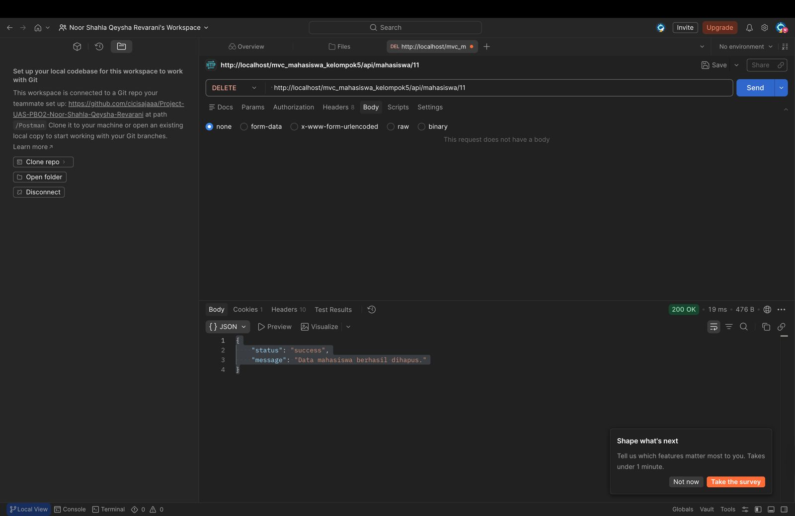

### 404 Not Found
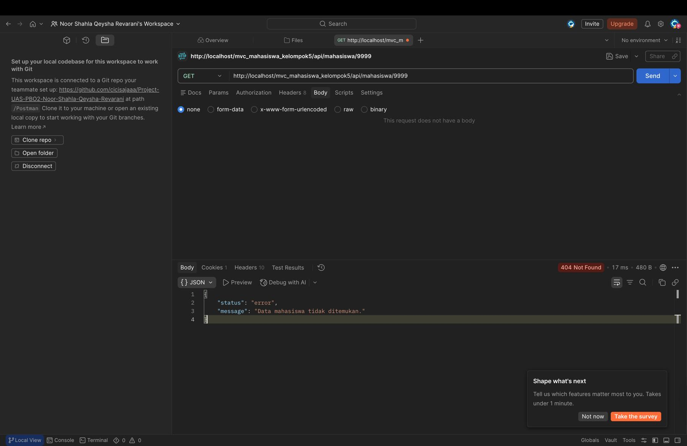

### 400 Bad Request
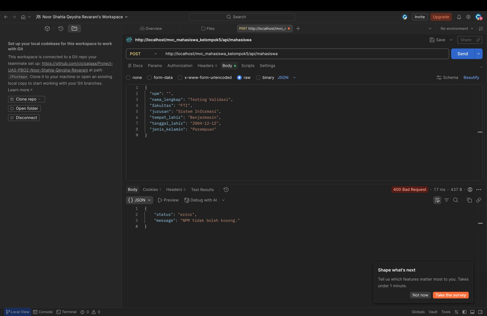

Kesimpulan: API berjalan.

---

## 🔗 Repository
https://github.com/tasyalraa/mvc_mahasiswa_kelompok5.git
