# 📘 Dokumentasi Praktikum PHP MVC

## Sesi 1 – Persiapan Proyek

### 👥 Identitas Kelompok

* Nama Kelompok: Kelompok 5
* Backend Engineer (BE): Noor Shahla Qeysha Revarani
* Frontend Engineer (FE): Patimatul Jahrah (2310010234)
* Documentation & Debugging Officer (DDO): Tasya Rosalinda (2310010225)

---

### 🎯 Tujuan Sesi

Pada sesi ini, kami mempelajari dasar arsitektur MVC serta menyiapkan lingkungan pengembangan. Fokus utama adalah membuat struktur proyek, menghubungkan database, dan memastikan aplikasi dapat berjalan dengan baik.

---

### 🧱 Struktur Proyek

Struktur folder utama yang digunakan dalam proyek ini adalah:

```
mvc_mahasiswa_kelompok5/
├── app/
├── config/
├── core/
├── public/
├── docs/
```

Struktur ini mengikuti pola MVC (Model-View-Controller) yang memisahkan logika program, tampilan, dan pengolahan data.

---

### ⚙️ Konfigurasi Database

Database yang digunakan:

* Nama database: `uniska_latihan_mvc_2026`
* DBMS: MySQL (Laragon)

Koneksi database dilakukan menggunakan PDO dengan konfigurasi host `localhost`, username `root`, dan password kosong.

---

### 🧪 Hasil Pengujian

Pengujian dilakukan dengan menjalankan file `test_db.php` untuk memastikan koneksi database berhasil.

Hasil:

* Koneksi ke database berhasil
* Tidak terdapat error pada konfigurasi awal

---

### 📸 Dokumentasi Screenshot

#### 1. Struktur Folder di VSCode


#### 2. Isi Folder Public


#### 3. Koneksi Database Berhasil


#### 4. Database di phpMyAdmin


---

### 🐛 Kendala yang Dihadapi

Beberapa kendala yang sempat terjadi:

* Error 404 akibat file `.htaccess` belum lengkap
* Perbedaan environment antara XAMPP dan Laragon
* Database belum dibuat sehingga koneksi gagal

---

### ✅ Solusi

* Menambahkan file `.htaccess` pada folder `public`
* Menyesuaikan URL dengan environment Laragon
* Membuat database sesuai dengan konfigurasi

---

### 📌 Kesimpulan

Pada sesi ini, proyek berhasil disiapkan dengan baik. Struktur MVC sudah terbentuk, koneksi database berhasil dilakukan, dan aplikasi siap dikembangkan ke tahap berikutnya.

---

---

## 📘 Sesi 2 – Implementasi Routing

### 🎯 Tujuan Sesi

Pada sesi ini, kami mulai mengimplementasikan sistem routing dalam arsitektur MVC. Routing berfungsi untuk mengarahkan URL ke controller dan method yang sesuai.

---

### 🧠 Konsep Dasar

Routing bekerja dengan pola URL sebagai berikut:

```
/controller/method
```

Contoh:

```
/home/index
```

Artinya:

* Controller: HomeController
* Method: index()

---

### ⚙️ Implementasi

Pada sesi ini dilakukan:

* Pembuatan class `Router.php`
* Pembuatan base `Controller.php`
* Pembuatan controller awal `HomeController`
* Parsing URL untuk menentukan controller dan method

---

### 🧪 Hasil Pengujian

Pengujian dilakukan dengan mengakses URL:

```
http://mvc_mahasiswa_kelompok5.test/home/index
```

Hasil:

* Routing berjalan dengan baik
* Controller berhasil dipanggil
* Method `index()` berhasil dijalankan

---

### 📸 Dokumentasi Screenshot

#### 1. File Router.php


#### 2. HomeController


#### 3. View Home (index.php)


#### 4. Hasil di Browser


---

### 🐛 Kendala yang Dihadapi

Beberapa kendala yang muncul:

* Error controller tidak ditemukan
* Method tidak dikenali
* Kesalahan penulisan URL

---

### ✅ Solusi

* Memastikan nama controller sesuai dengan yang dipanggil
* Menambahkan method yang dibutuhkan dalam controller
* Memperbaiki parsing URL pada Router

---

### 📌 Kesimpulan

Pada sesi ini, sistem routing berhasil diimplementasikan. Aplikasi sudah mampu mengarahkan URL ke controller dan method yang sesuai, sehingga menjadi dasar penting dalam pengembangan aplikasi berbasis MVC.

---

---

## 📘 Sesi 3 – Menampilkan Data Mahasiswa

### 🎯 Tujuan Sesi

Pada sesi ini, kami mulai menghubungkan aplikasi dengan database untuk menampilkan data mahasiswa. Proses ini melibatkan penggunaan Model, Controller, dan View secara terintegrasi.

---

### 🧠 Konsep Dasar

Alur pengambilan data dalam MVC pada sesi ini adalah:

```
Controller → Model → Database → Controller → View
```

Penjelasan:

* Controller memanggil Model
* Model mengambil data dari database
* Data dikembalikan ke Controller
* Controller mengirim data ke View untuk ditampilkan

---

### ⚙️ Implementasi

Pada sesi ini dilakukan:

* Pembuatan Model `Mahasiswa.php`
* Pembuatan `MahasiswaController.php`
* Query database untuk mengambil data mahasiswa
* Pengiriman data ke View
* Pembuatan tampilan tabel mahasiswa

---

### 🧪 Hasil Pengujian

Pengujian dilakukan dengan mengakses URL:

```
http://mvc_mahasiswa_kelompok5.test/mahasiswa/index
```

Hasil:

* Data mahasiswa berhasil diambil dari database
* Data ditampilkan dalam bentuk tabel
* Tidak terdapat error pada proses pengambilan data

---

### 📸 Dokumentasi Screenshot

#### 1. Model Mahasiswa


#### 2. MahasiswaController


#### 3. View Tabel Mahasiswa


#### 4. Hasil di Browser


---

### 🐛 Kendala yang Dihadapi

Beberapa kendala yang muncul:

* Data tidak tampil karena tabel kosong
* Kesalahan query SQL
* Data tidak terkirim dari controller ke view

---

### ✅ Solusi

* Memastikan tabel `mahasiswa` sudah dibuat di database
* Menambahkan data dummy untuk pengujian
* Memperbaiki query SQL dan variabel yang dikirim ke view

---

### 📌 Kesimpulan

Pada sesi ini, aplikasi berhasil menampilkan data dari database ke dalam tampilan web. Implementasi Model mulai berjalan dengan baik dan memperkuat konsep MVC dalam pengembangan aplikasi.

---

---

## 📘 Sesi 4 – Menambahkan Data Mahasiswa

### 🎯 Tujuan Sesi

Pada sesi ini, kami mengimplementasikan fitur untuk menambahkan data mahasiswa ke dalam database melalui form. Proses ini melibatkan interaksi antara View, Controller, dan Model.

---

### 🧠 Konsep Dasar

Alur penambahan data dalam MVC adalah:

```id="n3k8f2"
View (Form) → Controller → Model → Database
```

Penjelasan:

* User mengisi form pada View
* Data dikirim ke Controller menggunakan method POST
* Controller memproses dan meneruskan ke Model
* Model menyimpan data ke database

---

### ⚙️ Implementasi

Pada sesi ini dilakukan:

* Pembuatan form tambah data mahasiswa pada View
* Penambahan method pada `MahasiswaController` untuk menangani input
* Penambahan fungsi insert pada Model `Mahasiswa`
* Proses penyimpanan data ke database

---

### 🧪 Hasil Pengujian

Pengujian dilakukan dengan mengakses URL:

```id="r6f2q1"
http://mvc_mahasiswa_kelompok5.test/mahasiswa/tambah
```

Langkah pengujian:

1. Mengisi form data mahasiswa
2. Menekan tombol submit
3. Sistem menyimpan data ke database
4. Data baru muncul pada tabel mahasiswa

Hasil:

* Data berhasil ditambahkan ke database
* Tidak terjadi error saat proses input
* Tampilan tabel berhasil diperbarui

---

### 📸 Dokumentasi Screenshot

#### 1. Form Tambah Mahasiswa

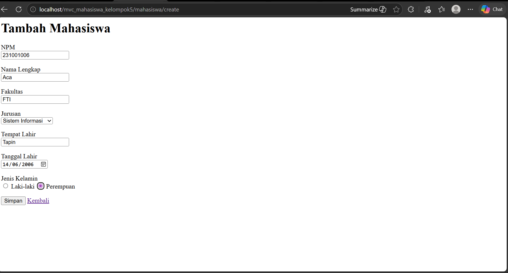

#### 2. MahasiswaController (Method Tambah)

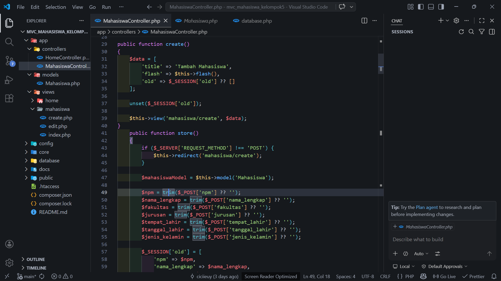

#### 3. Model (Query Insert)

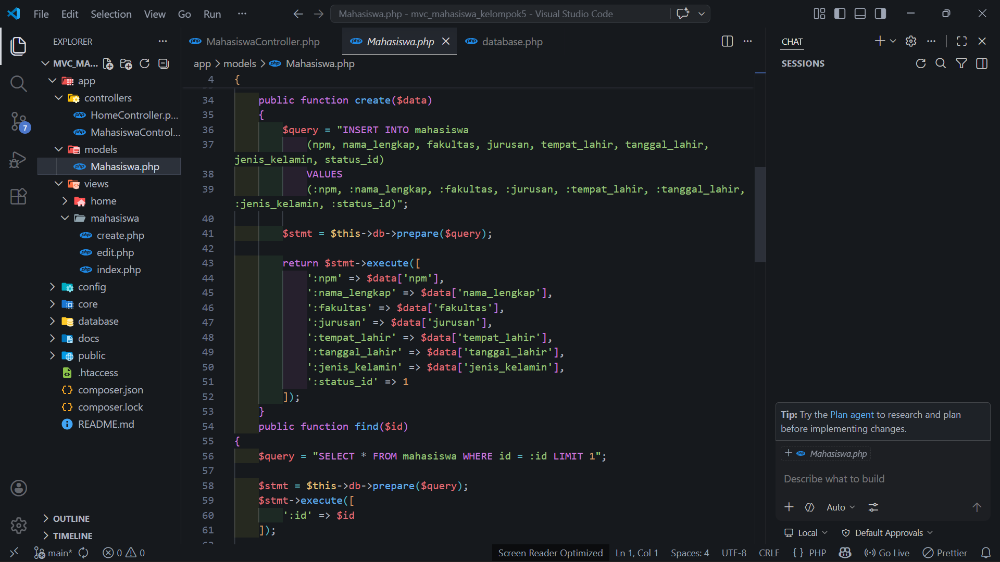

#### 4. Hasil di Tabel


---

### 🐛 Kendala yang Dihadapi

Beberapa kendala yang muncul:

* Method tidak ditemukan karena perbedaan nama URL
* Data tidak tersimpan akibat kesalahan query
* Input form tidak terbaca karena name tidak sesuai

---

### ✅ Solusi

* Menyesuaikan URL dengan method pada controller
* Memperbaiki query INSERT pada Model
* Menyamakan atribut `name` pada form dengan yang diproses di Controller

---

### 📌 Kesimpulan

Pada sesi ini, fitur penambahan data mahasiswa berhasil diimplementasikan dengan baik. Aplikasi sudah mampu menerima input dari user dan menyimpannya ke dalam database.

---

---

## 📘 Sesi 5 – Update dan Delete Data Mahasiswa

### 🎯 Tujuan Sesi

Pada sesi ini, kami mengimplementasikan fitur untuk mengubah (update) dan menghapus (delete) data mahasiswa. Dengan demikian, operasi CRUD (Create, Read, Update, Delete) pada aplikasi telah lengkap.

---

### 🧠 Konsep Dasar

#### ✏️ Update Data

```id="p3k9d2"
View (Form Edit) → Controller → Model → Database (UPDATE)
```

Penjelasan:

* User memilih data yang ingin diedit
* Data ditampilkan pada form edit
* Setelah diubah, data dikirim ke controller
* Model melakukan update ke database

---

#### 🗑️ Delete Data

```id="d7n2f1"
View (Tombol Delete) → Controller → Model → Database (DELETE)
```

Penjelasan:

* User menekan tombol delete
* Controller menerima ID data
* Model menghapus data dari database

---

### ⚙️ Implementasi

Pada sesi ini dilakukan:

* Penambahan tombol **Edit** dan **Delete** pada tabel mahasiswa
* Pembuatan method `edit()`, `update()`, dan `hapus()` pada `MahasiswaController`
* Pembuatan query `UPDATE` dan `DELETE` pada Model
* Pembuatan form edit untuk mengubah data

---

### 🧪 Hasil Pengujian

#### 🔹 Update Data

Langkah:

1. Klik tombol Edit
2. Mengubah data mahasiswa
3. Submit form

Hasil:

* Data berhasil diperbarui di database
* Perubahan langsung terlihat pada tabel

---

#### 🔹 Delete Data

Langkah:

1. Klik tombol Delete
2. Menghapus data

Hasil:

* Data berhasil dihapus dari database
* Data tidak lagi muncul di tabel

---

### 📸 Dokumentasi Screenshot

#### 1. Tombol Edit dan Delete pada Tabel

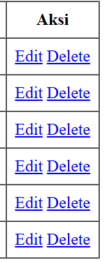

#### 2. Form Edit Mahasiswa

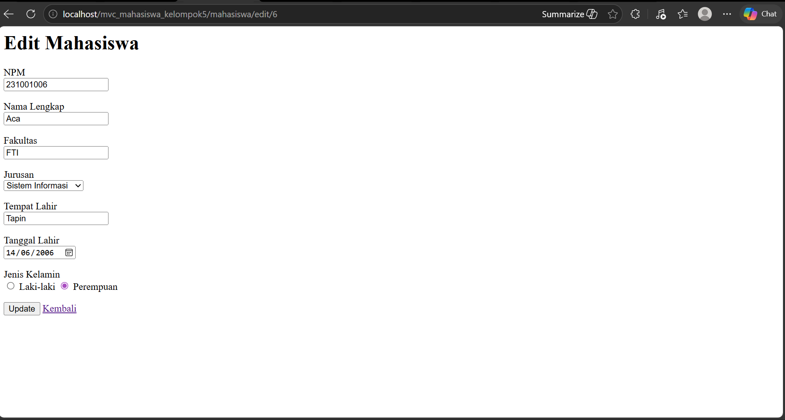

#### 3. Controller (Update & Delete)

Update
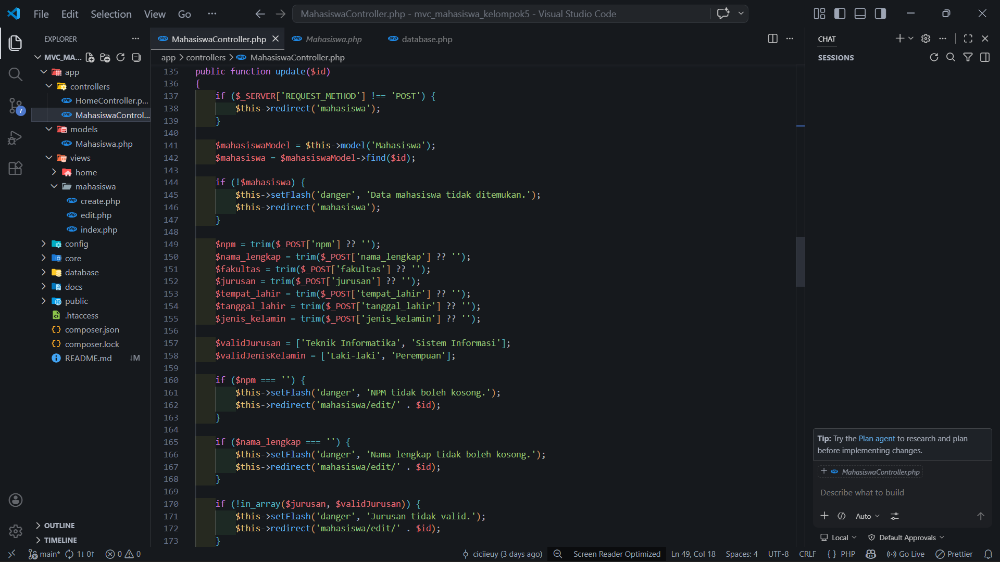

Delete
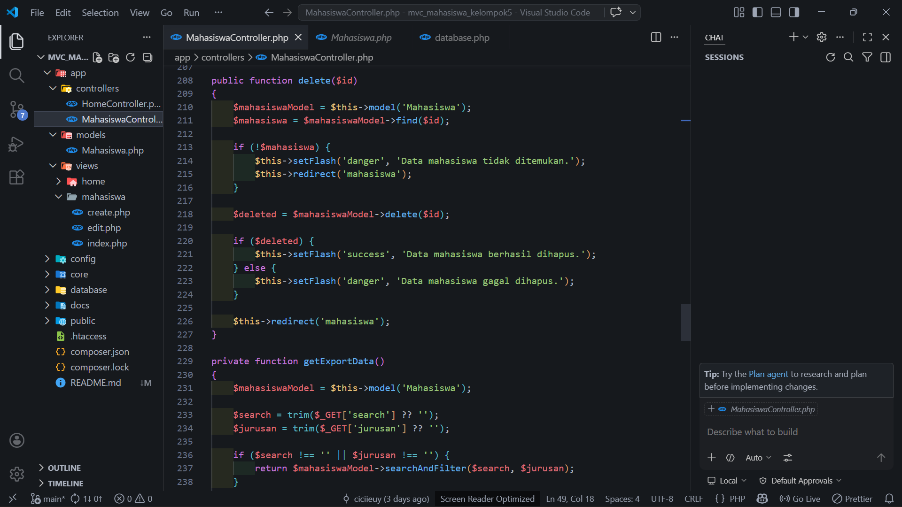

#### 4. Hasil Update Data


#### 5. Hasil Delete Data


---

### 🐛 Kendala yang Dihadapi

Beberapa kendala yang muncul:

* Data tidak berubah karena query UPDATE tidak sesuai
* Data tidak terhapus karena ID tidak terbaca
* Kesalahan pengiriman data dari form ke controller

---

### ✅ Solusi

* Memastikan query UPDATE dan DELETE sesuai dengan struktur tabel
* Mengirim parameter ID dengan benar
* Menyesuaikan atribut `name` pada form dengan controller

---

### 📌 Kesimpulan

Pada sesi ini, fitur update dan delete data mahasiswa berhasil diimplementasikan. Aplikasi telah memiliki fitur CRUD lengkap dan siap untuk pengembangan lebih lanjut.

---

---

## 📘 Sesi 6 – Search dan Filter Data Mahasiswa

### 🎯 Tujuan Sesi

Pada sesi ini, kami mengimplementasikan fitur pencarian (search) dan penyaringan (filter) data mahasiswa. Fitur ini memungkinkan pengguna untuk menampilkan data sesuai dengan kata kunci atau kategori tertentu.

---

### 🧠 Konsep Dasar

#### 🔍 Search Data

```id="k2n8x1"
SELECT * FROM mahasiswa WHERE nama_lengkap LIKE '%keyword%' OR npm LIKE '%keyword%'
```

Penjelasan:

* Digunakan untuk mencari data berdasarkan kata kunci
* Menggunakan operator `LIKE` agar pencarian fleksibel

---

#### 🧩 Filter Data

```id="m7p4q2"
SELECT * FROM mahasiswa WHERE jurusan = 'Informatika'
```

Penjelasan:

* Digunakan untuk menyaring data berdasarkan kategori tertentu
* Menggunakan kondisi `WHERE`

---

#### 🔗 Kombinasi Search & Filter

```id="v9x2l5"
SELECT * FROM mahasiswa WHERE nama_lengkap LIKE '%keyword%' AND jurusan = 'Informatika'
```

Penjelasan:

* Search dan filter dapat digunakan bersamaan
* Query akan menyesuaikan berdasarkan input user

---

### ⚙️ Implementasi

Pada sesi ini dilakukan:

* Penambahan form search pada halaman mahasiswa
* Penambahan dropdown filter jurusan
* Pengambilan parameter menggunakan method GET
* Pembuatan fungsi `searchAndFilter()` pada Model
* Modifikasi query menggunakan kondisi dinamis

---

### 🧪 Hasil Pengujian

Pengujian dilakukan pada halaman:

```id="q3r8t1"
http://mvc_mahasiswa_kelompok5.test/mahasiswa
```

Langkah:

1. Menginput kata kunci pada kolom pencarian
2. Memilih filter jurusan (opsional)
3. Menekan tombol cari

Hasil:

* Data ditampilkan sesuai dengan kata kunci
* Data dapat difilter berdasarkan jurusan
* Kombinasi search dan filter berjalan dengan baik

---

### 📸 Dokumentasi Screenshot

#### 1. Form Search dan Filter

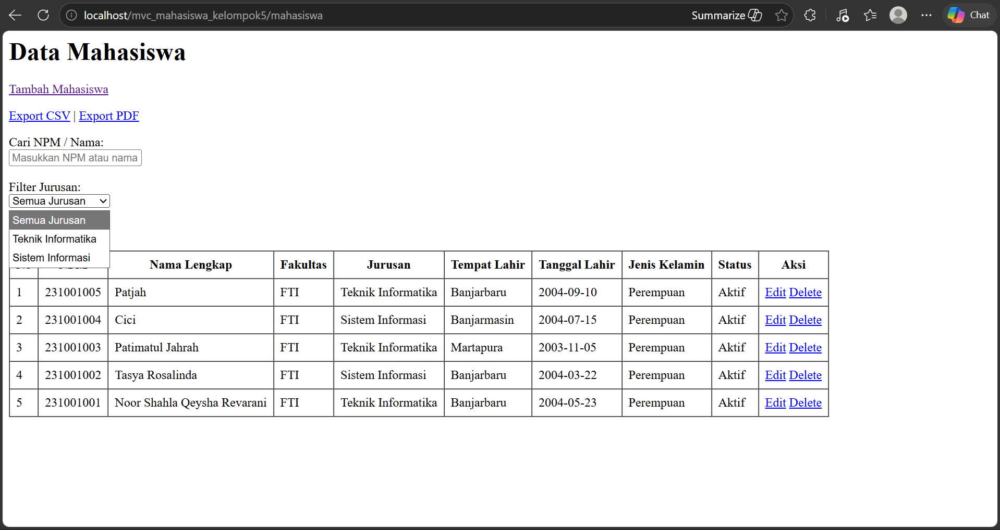

#### 2. Controller (Logic Search & Filter)

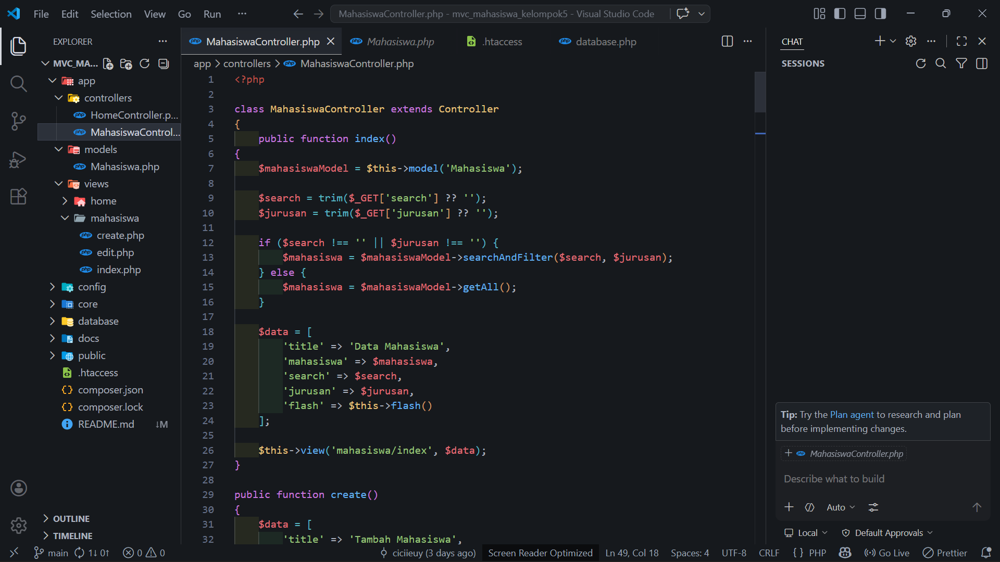

#### 3. Model (Query Search & Filter)

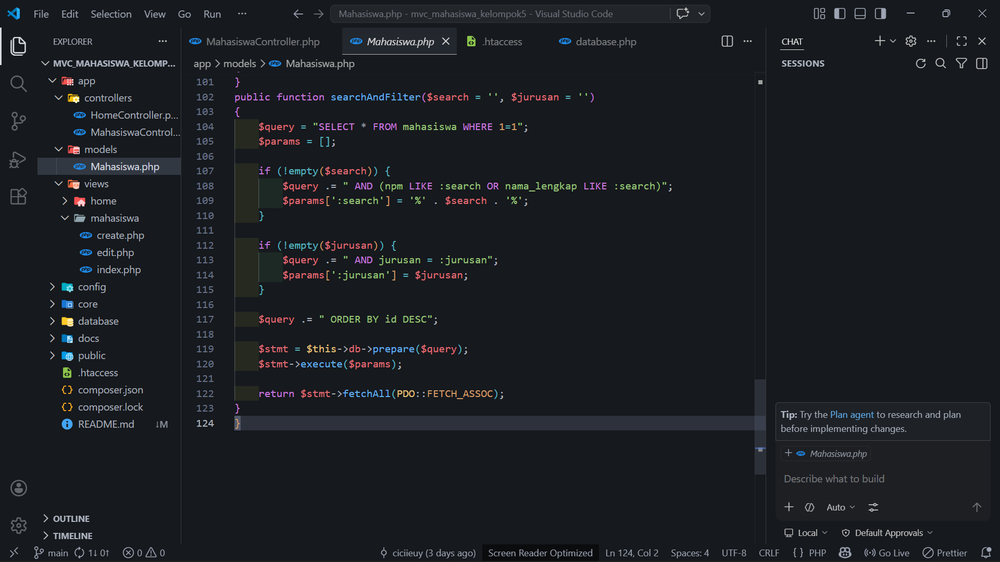

#### 4. Hasil di Browser

Search


Filter
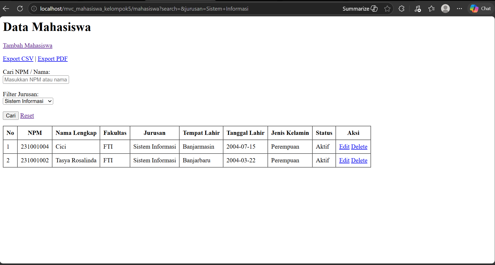

---

### 🐛 Kendala yang Dihadapi

Beberapa kendala yang muncul:

* Data tidak berubah karena parameter tidak terbaca
* Query tidak sesuai sehingga hasil tidak akurat
* Input kosong tidak ditangani dengan baik

---

### ✅ Solusi

* Menggunakan method GET untuk mengambil parameter dari URL
* Menggunakan prepared statement untuk keamanan query
* Menambahkan kondisi dinamis pada query sesuai input user

---

### 📌 Kesimpulan

Pada sesi ini, fitur pencarian dan filter data mahasiswa berhasil diimplementasikan. Aplikasi menjadi lebih interaktif karena pengguna dapat mencari dan menyaring data sesuai kebutuhan.

---

---

## 📘 Sesi 7 – Implementasi Tampilan dengan Bootstrap

### 🎯 Tujuan Sesi

Pada sesi ini, kami mengimplementasikan tampilan antarmuka menggunakan Bootstrap agar aplikasi memiliki desain yang lebih modern, responsif, dan konsisten.

---

### 🧠 Konsep Dasar

Bootstrap merupakan framework CSS yang digunakan untuk mempermudah pembuatan tampilan web yang rapi dan responsif tanpa harus menulis CSS dari awal.

Dengan menggunakan Bootstrap, tampilan aplikasi menjadi:

* Lebih modern
* Responsif di berbagai perangkat
* Konsisten di setiap halaman

---

### ⚙️ Implementasi

Pada sesi ini dilakukan:

* Menambahkan Bootstrap ke dalam project melalui CDN
* Membuat layout menggunakan `header.php` dan `footer.php`
* Menambahkan navbar pada aplikasi
* Menerapkan class Bootstrap pada tabel dan form

---

### 🧪 Hasil Pengujian

Hasil yang diperoleh:

* Halaman mahasiswa tampil lebih rapi dan terstruktur
* Form input terlihat lebih jelas dan mudah digunakan
* Tampilan aplikasi menjadi lebih menarik dibandingkan sebelumnya

---

### 📸 Dokumentasi Screenshot

#### 1. Halaman Index Mahasiswa (Bootstrap)


#### 2. Form Tambah Mahasiswa

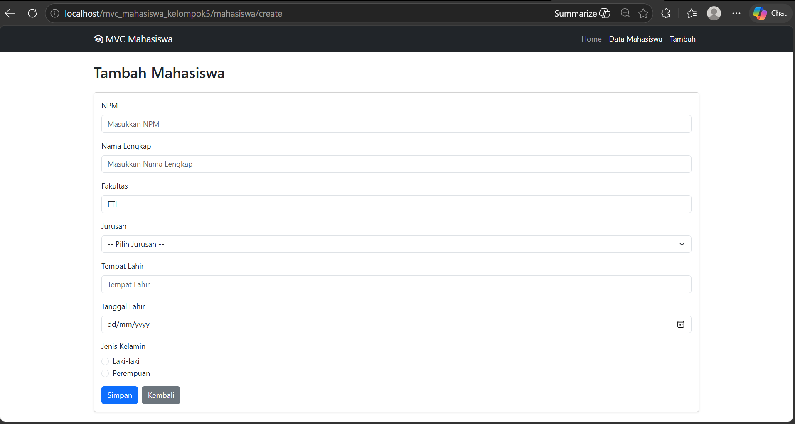

---

### 📌 Kesimpulan

Pada sesi ini, implementasi Bootstrap berhasil meningkatkan tampilan aplikasi menjadi lebih modern, responsif, dan konsisten. Hal ini membuat aplikasi lebih nyaman digunakan oleh pengguna.

---
