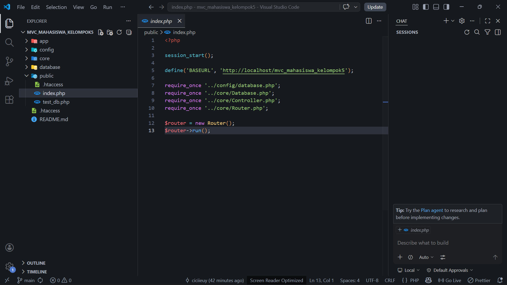
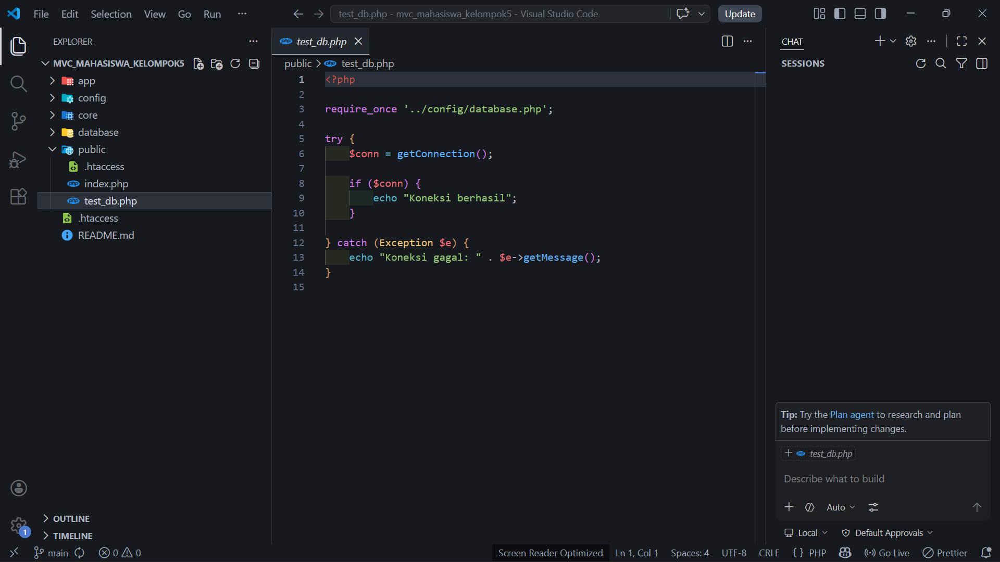
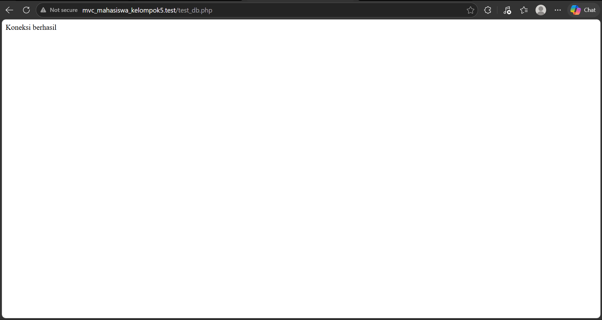
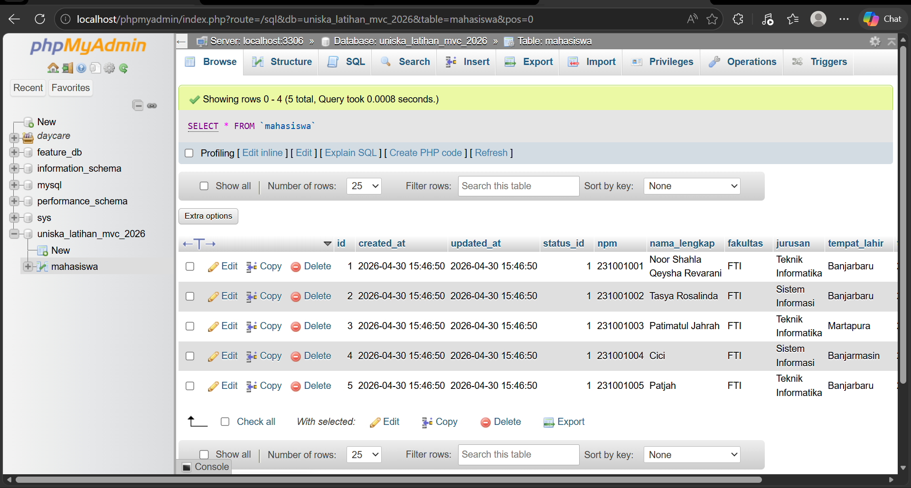
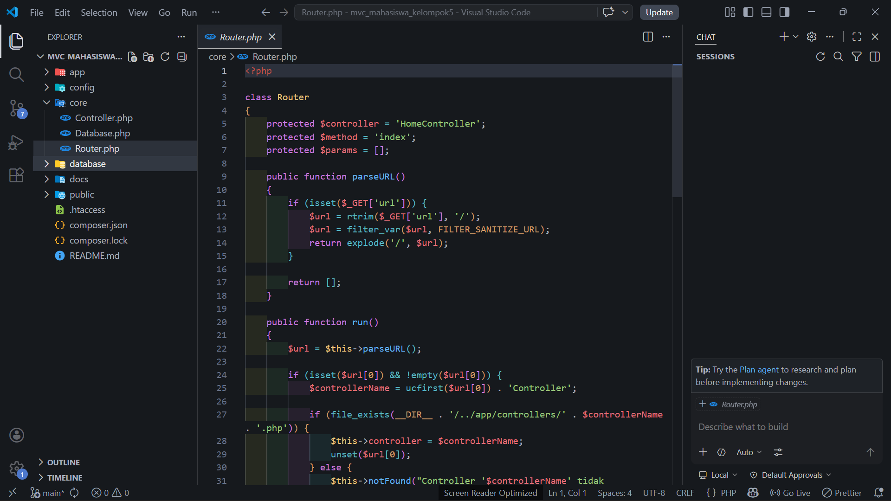
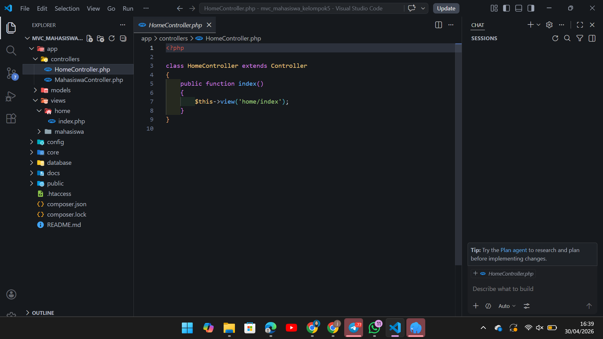
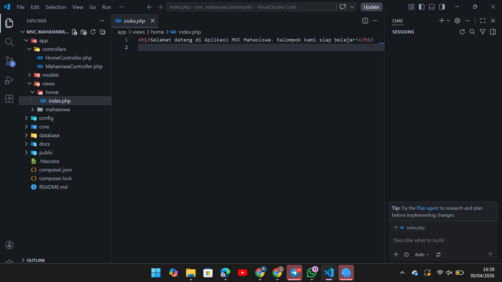
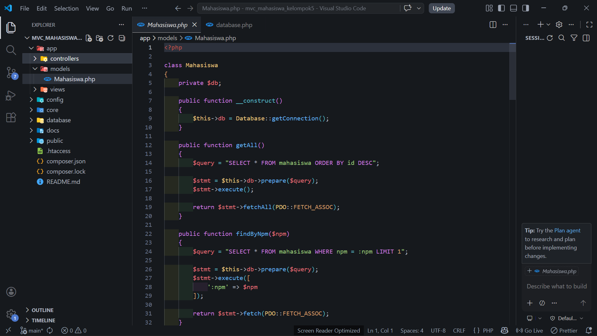
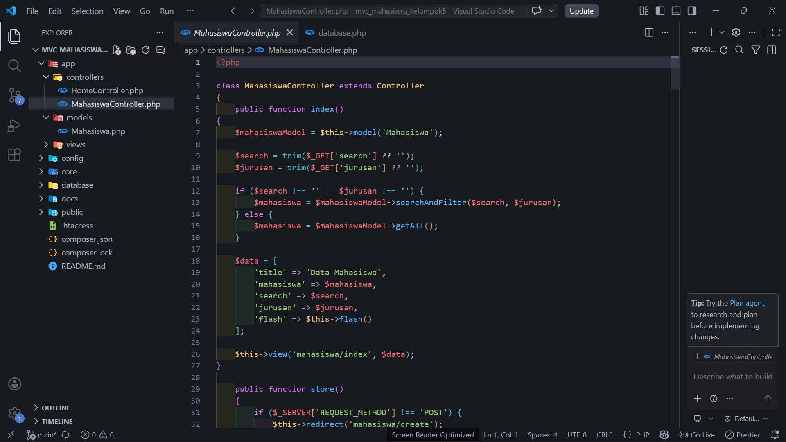
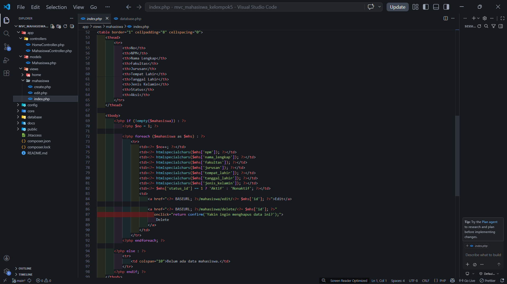

# 📘 Dokumentasi Praktikum PHP MVC

## Sesi 1 – Persiapan Proyek

### 👥 Identitas Kelompok

* Nama Kelompok: Kelompok 5
* Backend Engineer (BE): Noor Shahla Qeysha Revarani
* Frontend Engineer (FE): Patimatul Jahrah (2310010234)
* Documentation & Debugging Officer (DDO): Tasya Rosalinda (2310010225)

---

### 🎯 Tujuan Sesi

Pada sesi ini, kami mempelajari dasar arsitektur MVC serta menyiapkan lingkungan pengembangan. Fokus utama adalah membuat struktur proyek, menghubungkan database, dan memastikan aplikasi dapat berjalan dengan baik.

---

### 🧱 Struktur Proyek

Struktur folder utama yang digunakan dalam proyek ini adalah:

```text
mvc_mahasiswa_kelompok5/
├── app/
├── config/
├── core/
├── public/
├── docs/
```

Struktur ini mengikuti pola MVC (Model-View-Controller) yang memisahkan logika program, tampilan, dan pengolahan data.

---

### ⚙️ Konfigurasi Database

Database yang digunakan:

* Nama database: `uniska_latihan_mvc_2026`
* DBMS: MySQL (Laragon)

Koneksi database dilakukan menggunakan PDO dengan konfigurasi host `localhost`, username `root`, dan password kosong.

---

### 🧪 Hasil Pengujian

Pengujian dilakukan dengan menjalankan file `test_db.php` untuk memastikan koneksi database berhasil.

Hasil:

* Koneksi ke database berhasil
* Tidak terdapat error pada konfigurasi awal

---

### 📸 Dokumentasi Screenshot

#### 1. Struktur Folder di VSCode


#### 2. Isi Folder Public





#### 3. Koneksi Database Berhasil



#### 4. Database di phpMyAdmin



---

### 🐛 Kendala yang Dihadapi

Beberapa kendala yang sempat terjadi:

* Error 404 akibat file `.htaccess` belum lengkap
* Perbedaan environment antara XAMPP dan Laragon
* Database belum dibuat sehingga koneksi gagal

---

### ✅ Solusi

* Menambahkan file `.htaccess` pada folder `public`
* Menyesuaikan URL dengan environment Laragon
* Membuat database sesuai dengan konfigurasi

---

### 📌 Kesimpulan

Pada sesi ini, proyek berhasil disiapkan dengan baik. Struktur MVC sudah terbentuk, koneksi database berhasil dilakukan, dan aplikasi siap dikembangkan ke tahap berikutnya.

---

# 📘 Sesi 2 – Implementasi Routing

### 🎯 Tujuan Sesi

Pada sesi ini, kami mulai mengimplementasikan sistem routing dalam arsitektur MVC. Routing berfungsi untuk mengarahkan URL ke controller dan method yang sesuai.

---

### 🧠 Konsep Dasar

Routing bekerja dengan pola URL sebagai berikut:

```text
/controller/method
```

Contoh:

```text
/home/index
```

Artinya:

* Controller: `HomeController`
* Method: `index()`

---

### ⚙️ Implementasi

Pada sesi ini dilakukan:

* Pembuatan class `Router.php`
* Pembuatan base `Controller.php`
* Pembuatan controller awal `HomeController`
* Parsing URL untuk menentukan controller dan method

---

### 🧪 Hasil Pengujian

Pengujian dilakukan dengan mengakses URL:

```text
http://mvc_mahasiswa_kelompok5.test/home/index
```

Hasil:

* Routing berjalan dengan baik
* Controller berhasil dipanggil
* Method `index()` berhasil dijalankan

---

### 📸 Dokumentasi Screenshot

#### 1. File Router.php



#### 2. HomeController



#### 3. View Home (index.php)



#### 4. Hasil di Browser


---

### 🐛 Kendala yang Dihadapi

Beberapa kendala yang muncul:

* Error controller tidak ditemukan
* Method tidak dikenali
* Kesalahan penulisan URL

---

### ✅ Solusi

* Memastikan nama controller sesuai dengan yang dipanggil
* Menambahkan method yang dibutuhkan dalam controller
* Memperbaiki parsing URL pada Router

---

### 📌 Kesimpulan

Pada sesi ini, sistem routing berhasil diimplementasikan. Aplikasi sudah mampu mengarahkan URL ke controller dan method yang sesuai, sehingga menjadi dasar penting dalam pengembangan aplikasi berbasis MVC.

---

# 📘 Sesi 3 – Menampilkan Data Mahasiswa

### 🎯 Tujuan Sesi

Pada sesi ini, kami mulai menghubungkan aplikasi dengan database untuk menampilkan data mahasiswa. Proses ini melibatkan penggunaan Model, Controller, dan View secara terintegrasi.

---

### 🧠 Konsep Dasar

Alur pengambilan data dalam MVC pada sesi ini adalah:

```text
Controller → Model → Database → Controller → View
```

Penjelasan:

* Controller memanggil Model
* Model mengambil data dari database
* Data dikembalikan ke Controller
* Controller mengirim data ke View untuk ditampilkan

---

### ⚙️ Implementasi

Pada sesi ini dilakukan:

* Pembuatan Model `Mahasiswa.php`
* Pembuatan `MahasiswaController.php`
* Query database untuk mengambil data mahasiswa
* Pengiriman data ke View
* Pembuatan tampilan tabel mahasiswa

---

### 🧪 Hasil Pengujian

Pengujian dilakukan dengan mengakses URL:

```text
http://mvc_mahasiswa_kelompok5.test/mahasiswa/index
```

Hasil:

* Data mahasiswa berhasil diambil dari database
* Data ditampilkan dalam bentuk tabel
* Tidak terdapat error pada proses pengambilan data

---

### 📸 Dokumentasi Screenshot

#### 1. Model Mahasiswa



#### 2. MahasiswaController



#### 3. View Tabel Mahasiswa



#### 4. Hasil di Browser


---

### 🐛 Kendala yang Dihadapi

Beberapa kendala yang muncul:

* Data tidak tampil karena tabel kosong
* Kesalahan query SQL
* Data tidak terkirim dari controller ke view

---

### ✅ Solusi

* Memastikan tabel `mahasiswa` sudah dibuat di database
* Menambahkan data dummy untuk pengujian
* Memperbaiki query SQL dan variabel yang dikirim ke view

---

### 📌 Kesimpulan

Pada sesi ini, aplikasi berhasil menampilkan data dari database ke dalam tampilan web. Implementasi Model mulai berjalan dengan baik dan memperkuat konsep MVC dalam pengembangan aplikasi.

# REST API Mahasiswa – PHP MVC

## Deskripsi

Fitur ini merupakan implementasi REST API pada aplikasi PHP berbasis MVC untuk mengelola data mahasiswa.

API memungkinkan aplikasi tidak hanya diakses melalui tampilan web, tetapi juga dapat digunakan oleh client lain seperti Postman, frontend terpisah, maupun aplikasi mobile.

Response API menggunakan format JSON tanpa melibatkan view HTML.

---

## Tujuan

* Menyediakan endpoint RESTful untuk data mahasiswa
* Mendukung operasi CRUD melalui HTTP request (GET, POST, PUT, DELETE)
* Memisahkan akses web (HTML) dan API (JSON)
* Memungkinkan integrasi dengan sistem lain

---

## Perbedaan Web dan API

| Jenis    | Endpoint       | Output | Pengguna                |
| -------- | -------------- | ------ | ----------------------- |
| Web MVC  | /mahasiswa     | HTML   | User melalui browser    |
| REST API | /api/mahasiswa | JSON   | Postman / aplikasi lain |

---

## Alur Kerja API

Client / Postman
→ Mengirim request ke endpoint `/api/mahasiswa`
→ Router mendeteksi prefix `/api`
→ Router mengarahkan request ke `ApiMahasiswaController`
→ Controller membaca HTTP method (GET, POST, PUT, DELETE)
→ Controller memanggil Model `Mahasiswa`
→ Model mengakses database MySQL
→ Controller mengembalikan response dalam format JSON

Perbandingan:

Web:
Request → Controller → Model → Database → View (HTML)

API:
Request → API Controller → Model → Database → JSON Response

---

## File yang Digunakan

* app/controllers/ApiMahasiswaController.php
* core/Router.php
* app/models/Mahasiswa.php

---

## Endpoint API

| Method | Endpoint            | Fungsi                        | Status      |
| ------ | ------------------- | ----------------------------- | ----------- |
| GET    | /api/mahasiswa      | Mengambil semua data          | 200 OK      |
| GET    | /api/mahasiswa/{id} | Mengambil data berdasarkan ID | 200 OK      |
| POST   | /api/mahasiswa      | Menambahkan data              | 201 Created |
| PUT    | /api/mahasiswa/{id} | Mengubah data                 | 200 OK      |
| DELETE | /api/mahasiswa/{id} | Menghapus data                | 200 OK      |

### Error Handling

* 400 Bad Request → Validasi gagal
* 404 Not Found → Data tidak ditemukan
* 405 Method Not Allowed → Method tidak diizinkan

---

## Validasi Data

Validasi diterapkan pada endpoint POST dan PUT:

* NPM tidak boleh kosong
* NPM tidak boleh duplikat
* Nama lengkap tidak boleh kosong
* Fakultas tidak boleh kosong
* Jurusan hanya boleh: Teknik Informatika / Sistem Informasi
* Tempat lahir tidak boleh kosong
* Tanggal lahir tidak boleh kosong
* Jenis kelamin hanya boleh: Laki-laki / Perempuan

Contoh response validasi gagal:

```json
{
  "status": "error",
  "message": "NPM tidak boleh kosong."
}
```

---

## Contoh Body JSON

Digunakan pada POST dan PUT:

```json
{
  "npm": "231001200",
  "nama_lengkap": "Testing API",
  "fakultas": "FTI",
  "jurusan": "Sistem Informasi",
  "tempat_lahir": "Banjarmasin",
  "tanggal_lahir": "2004-12-12",
  "jenis_kelamin": "Perempuan"
}
```

---

## Cara Menjalankan API

1. Jalankan Apache dan MySQL melalui XAMPP
2. Import database `uniska_latihan_mvc_2026`
3. Pastikan project berada di folder htdocs
4. Buka Postman
5. Gunakan endpoint berikut:

```
http://localhost/mvc_mahasiswa_kelompok5/api/mahasiswa
```

Jika menggunakan port lain (misalnya 8080):

```
http://localhost:8080/mvc_mahasiswa_kelompok5/api/mahasiswa
```

---

## Hasil Pengujian

### GET Semua Data


### GET Detail


### POST Data


### PUT Update


### DELETE Data


### Error 404


### Error 400


---

## Ringkasan Hasil Pengujian

| Method | Endpoint            | Hasil           |
| ------ | ------------------- | --------------- |
| GET    | /api/mahasiswa      | 200 OK          |
| GET    | /api/mahasiswa/{id} | 200 OK          |
| POST   | /api/mahasiswa      | 201 Created     |
| PUT    | /api/mahasiswa/{id} | 200 OK          |
| DELETE | /api/mahasiswa/{id} | 200 OK          |
| GET    | /api/mahasiswa/9999 | 404 Not Found   |
| POST   | /api/mahasiswa      | 400 Bad Request |

---
## Kode Program

### 1. ApiMahasiswaController.php

```php
<?php
class ApiMahasiswaController extends Controller
{
    private function jsonResponse($data, $statusCode = 200)
    {
        http_response_code($statusCode);
        header('Content-Type: application/json; charset=utf-8');
        echo json_encode($data, JSON_PRETTY_PRINT);
        exit;
    }

    private function getJsonInput()
    {
        $json = file_get_contents('php://input');
        $data = json_decode($json, true);
        return is_array($data) ? $data : [];
    }

    private function validateMahasiswaData($data)
    {
        $npm = trim($data['npm'] ?? '');
        $nama_lengkap = trim($data['nama_lengkap'] ?? '');
        $fakultas = trim($data['fakultas'] ?? '');
        $jurusan = trim($data['jurusan'] ?? '');
        $tempat_lahir = trim($data['tempat_lahir'] ?? '');
        $tanggal_lahir = trim($data['tanggal_lahir'] ?? '');
        $jenis_kelamin = trim($data['jenis_kelamin'] ?? '');

        $validJurusan = ['Teknik Informatika', 'Sistem Informasi'];
        $validJenisKelamin = ['Laki-laki', 'Perempuan'];

        if ($npm === '') return ['valid' => false, 'message' => 'NPM tidak boleh kosong.'];
        if ($nama_lengkap === '') return ['valid' => false, 'message' => 'Nama lengkap tidak boleh kosong.'];
        if ($fakultas === '') return ['valid' => false, 'message' => 'Fakultas tidak boleh kosong.'];
        if (!in_array($jurusan, $validJurusan)) return ['valid' => false, 'message' => 'Jurusan tidak valid.'];
        if ($tempat_lahir === '') return ['valid' => false, 'message' => 'Tempat lahir tidak boleh kosong.'];
        if ($tanggal_lahir === '') return ['valid' => false, 'message' => 'Tanggal lahir tidak boleh kosong.'];
        if (!in_array($jenis_kelamin, $validJenisKelamin)) return ['valid' => false, 'message' => 'Jenis kelamin tidak valid.'];

        return [
            'valid' => true,
            'data' => [
                'npm' => $npm,
                'nama_lengkap' => $nama_lengkap,
                'fakultas' => $fakultas,
                'jurusan' => $jurusan,
                'tempat_lahir' => $tempat_lahir,
                'tanggal_lahir' => $tanggal_lahir,
                'jenis_kelamin' => $jenis_kelamin
            ]
        ];
    }

    public function index()
    {
        $m = $this->model('Mahasiswa');
        $data = $m->getAll();

        $this->jsonResponse([
            'status' => 'success',
            'message' => 'Data mahasiswa berhasil diambil.',
            'data' => $data
        ], 200);
    }

    public function show($id)
    {
        $m = $this->model('Mahasiswa');
        $data = $m->find($id);

        if (!$data) {
            $this->jsonResponse([
                'status' => 'error',
                'message' => 'Data mahasiswa tidak ditemukan.'
            ], 404);
        }

        $this->jsonResponse([
            'status' => 'success',
            'message' => 'Data mahasiswa berhasil ditemukan.',
            'data' => $data
        ], 200);
    }

    public function store()
    {
        $input = $this->getJsonInput();
        $val = $this->validateMahasiswaData($input);

        if (!$val['valid']) {
            $this->jsonResponse([
                'status' => 'error',
                'message' => $val['message']
            ], 400);
        }

        $m = $this->model('Mahasiswa');

        if ($m->findByNpm($val['data']['npm'])) {
            $this->jsonResponse([
                'status' => 'error',
                'message' => 'NPM sudah terdaftar.'
            ], 400);
        }

        $m->create($val['data']);

        $this->jsonResponse([
            'status' => 'success',
            'message' => 'Data mahasiswa berhasil ditambahkan.'
        ], 201);
    }

    public function update($id)
    {
        $m = $this->model('Mahasiswa');

        if (!$m->find($id)) {
            $this->jsonResponse([
                'status' => 'error',
                'message' => 'Data mahasiswa tidak ditemukan.'
            ], 404);
        }

        $input = $this->getJsonInput();
        $val = $this->validateMahasiswaData($input);

        if (!$val['valid']) {
            $this->jsonResponse([
                'status' => 'error',
                'message' => $val['message']
            ], 400);
        }

        $existing = $m->findByNpm($val['data']['npm']);

        if ($existing && $existing['id'] != $id) {
            $this->jsonResponse([
                'status' => 'error',
                'message' => 'NPM sudah digunakan oleh mahasiswa lain.'
            ], 400);
        }

        $m->update($id, $val['data']);

        $this->jsonResponse([
            'status' => 'success',
            'message' => 'Data mahasiswa berhasil diperbarui.'
        ], 200);
    }

    public function delete($id)
    {
        $m = $this->model('Mahasiswa');

        if (!$m->find($id)) {
            $this->jsonResponse([
                'status' => 'error',
                'message' => 'Data mahasiswa tidak ditemukan.'
            ], 404);
        }

        $m->delete($id);

        $this->jsonResponse([
            'status' => 'success',
            'message' => 'Data mahasiswa berhasil dihapus.'
        ], 200);
    }

    public function methodNotAllowed()
    {
        $this->jsonResponse([
            'status' => 'error',
            'message' => 'Method tidak diizinkan.'
        ], 405);
    }
}
```

---

### 2. Router.php

```php
<?php
class Router
{
    public function run()
    {
        $url = $_GET['url'] ?? '';

        if (strpos($url, 'api') === 0) {
            require_once '../app/controllers/ApiMahasiswaController.php';
            $controller = new ApiMahasiswaController();

            $parts = explode('/', $url);
            $method = $_SERVER['REQUEST_METHOD'];
            $id = $parts[2] ?? null;

            if ($method === 'GET' && !$id) $controller->index();
            elseif ($method === 'GET') $controller->show($id);
            elseif ($method === 'POST') $controller->store();
            elseif ($method === 'PUT') $controller->update($id);
            elseif ($method === 'DELETE') $controller->delete($id);
            else $controller->methodNotAllowed();

            return;
        }
    }
}
```

---

### 3. Mahasiswa.php

```php
<?php
class Mahasiswa
{
    private $db;

    public function __construct()
    {
        $this->db = Database::getConnection();
    }

    public function getAll()
    {
        $stmt = $this->db->query("SELECT * FROM mahasiswa ORDER BY id DESC");
        return $stmt->fetchAll(PDO::FETCH_ASSOC);
    }

    public function find($id)
    {
        $stmt = $this->db->prepare("SELECT * FROM mahasiswa WHERE id=?");
        $stmt->execute([$id]);
        return $stmt->fetch(PDO::FETCH_ASSOC);
    }

    public function findByNpm($npm)
    {
        $stmt = $this->db->prepare("SELECT * FROM mahasiswa WHERE npm=?");
        $stmt->execute([$npm]);
        return $stmt->fetch(PDO::FETCH_ASSOC);
    }

    public function create($data)
    {
        $stmt = $this->db->prepare("
            INSERT INTO mahasiswa 
            (npm, nama_lengkap, fakultas, jurusan, tempat_lahir, tanggal_lahir, jenis_kelamin, status_id)
            VALUES (?, ?, ?, ?, ?, ?, ?, 1)
        ");
        return $stmt->execute(array_values($data));
    }

    public function update($id, $data)
    {
        $stmt = $this->db->prepare("
            UPDATE mahasiswa SET 
            npm=?, nama_lengkap=?, fakultas=?, jurusan=?, tempat_lahir=?, tanggal_lahir=?, jenis_kelamin=?
            WHERE id=?
        ");
        return $stmt->execute([...array_values($data), $id]);
    }

    public function delete($id)
    {
        $stmt = $this->db->prepare("DELETE FROM mahasiswa WHERE id=?");
        return $stmt->execute([$id]);
    }
}
```

## Kesimpulan

REST API Mahasiswa berhasil diimplementasikan dengan baik dan seluruh endpoint dapat digunakan untuk melakukan operasi CRUD.

API mampu menangani kondisi sukses maupun error dengan response JSON dan HTTP status code yang sesuai.

Dengan adanya fitur ini, aplikasi dapat digunakan tidak hanya melalui tampilan web, tetapi juga dapat terintegrasi dengan aplikasi lain seperti Postman, frontend terpisah, maupun aplikasi mobile.

---

## 🔗 Repository
https://github.com/tasyalraa/mvc_mahasiswa_kelompok5.git
